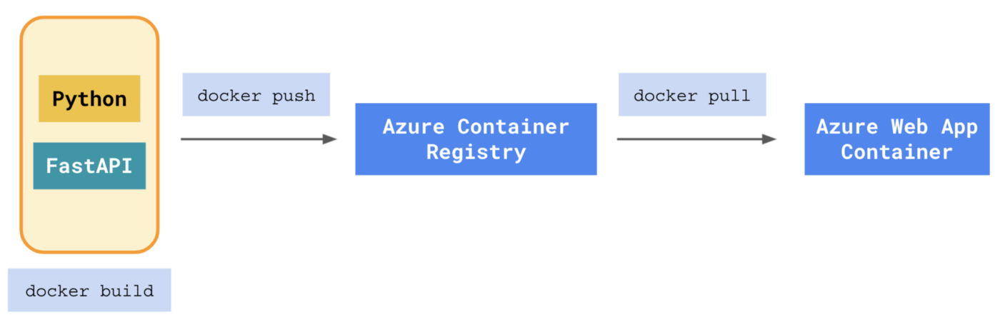

</br>

Live Demo:  ________

</br>

[WIP] A python web-application that _______. The async RESTful API is built with FastAPI, and Postgres then deployed to Azure using a Gunicorn WSGI server with integrated pytests & code coverage.

</br>



</br>

## Dev Objectives
- [ ] Develop an async private API with Python
- [ ] Create a login portal with Vue.js (then provide a superuser for others to test the app with) 
- [ ] Allow users to interact with a Postgres database asynchronously 
- [ ] Improve code quality with linters (black, flake8 & isort)
- [ ] Practice test-driven development (pytest & unit and integration tests with code coverage)
- [ ] Configure tests to run in parallel
- [ ] Containerize frontend, backend and db inside a Docker container
- [ ] Deploy dockerized application to an Azure app service using a pipeline through container registry
- [ ] Configure GitHub Actions for continuous integration and deployment

</br>

## Reproduction

<details>
  <summary>Requirements</summary>

</br>

- [Git](https://git-scm.com/) for command-line interface 
- [Pyenv](https://github.com/pyenv/pyenv) for Python version management tool
- [Poetry](https://python-poetry.org/docs/) for dependency management and packaging
- [Docker](https://docs.docker.com/get-docker/) for developing, shipping, and running applications
- [Azure CLI](https://docs.microsoft.com/en-us/cli/azure/install-azure-cli) for cloud deployment
</details>

</br>

<details>
  <summary>Reproduction on a local machine</summary>

</br>

- Clone the GitHub repository to an empty folder on your local machine:
    ```
    gh repo clone jordanhoare/azure_asp
    ```
- Initialise poetry:
    ```
    poetry build
    ```
- Build a docker image and run the container in detached mode:
    ```
    docker-compose build
    docker-compose up -d
    docker-compose logs web
    ```
- Check the logs of the web service:
    ```
    docker-compose logs web
    ```
</details>

</br>


<details>
  <summary>Azure Deployment</summary>

</br>

- Login:
    ```
    az login
    ```

</details>

</br>

</br>

## Useful Commands

<details>
  <summary>Useful docker commands</summary>

</br>

- Build the image and spin up the two containers:
    ```
    docker-compose up -d --build
    ```
- Bring down the containers and volumes
    ```
    docker-compose down -v
    ```
- Code quality:
    ```
    docker-compose exec web black . --check
    docker-compose exec web isort . --check-only
    docker-compose exec web flake8 .
    ```
</details>

</br>

<details>
  <summary>Pytest commands</summary>

</br>

- Normal run
    ```
    docker-compose exec web python -m pytest
    ```
- Disable warnings
    ```
    docker-compose exec web python -m pytest -p no:warnings
    ```
</br>

</details>

</br>

<details>
  <summary>Github Actions</summary>

</br>

- Build and tag the image:
    ```
    docker build -f ____________________
    ```
-  Authenticate to GitHub Packages with Docker:
    ```
    docker login ____________________
    ```
-  Push the image to the Container registry on GitHub Packages
    ```
    docker push ____________________
    ```
</details>

</br>
